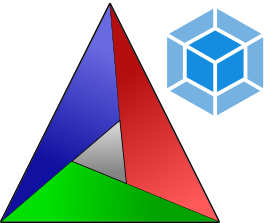

# CMakeModules

[](https://github.com/ZIMO-Elektronik/CMakeModules/actions/workflows/tests.yml)



CMakeModules bundles CMake modules and toolchain files.

### Modules
- CPM.cmake  
  CPM.cmake is a cross-platform CMake script that adds dependency management capabilities to CMake. It's built as a thin wrapper around CMake's [FetchContent](https://cmake.org/cmake/help/latest/module/FetchContent.html) module that adds version control, caching, a simple API [and more](https://github.com/cpm-cmake/CPM.cmake#comparison-to-pure-fetchcontent--externalproject).

- minify_html  
  Minify HTML code by removing comments, newlines and whitespaces.
  ```cmake
  minify_html(index.html ${CMAKE_BINARY_DIR}/index.html)
  ```

- sanatize  
  Add [-fsanitize](https://gcc.gnu.org/onlinedocs/gcc/Instrumentation-Options.html) options.
  ```cmake
  sanatize("address,undefined")
  ```

- target_common_warnings  
  Wrapper around [target_compile_options](https://cmake.org/cmake/help/latest/command/target_compile_options.html) which adds a bunch of useful compiler warnings to a target. Can also be called without any further arguments.

- target_compile_link_options
  Wrapper around [target_compile_options](https://cmake.org/cmake/help/latest/command/target_compile_options.html) and [target_link_options](https://cmake.org/cmake/help/latest/command/target_link_options.html). Simply invokes both commands with all arguments.

- target_suppress_warnings  
  Currently suppresses warnings from header files by prepending the SYSTEM keyword to INTERFACE_INCLUDE_DIRECTORIES. Would be great if all errors could be suppressed.

- target_unity_build  
  Enables the [UNITY_BUILD](https://cmake.org/cmake/help/latest/prop_tgt/UNITY_BUILD.html) target property and sets [UNITY_BUILD_BATCH_SIZE](https://cmake.org/cmake/help/latest/prop_tgt/UNITY_BUILD_BATCH_SIZE.html#prop_tgt:UNITY_BUILD_BATCH_SIZE) 0.

- version_from_git  
  The function uses the output of `git describe --tags` to generate a MAJOR.MINOR.PATCH version string. This project versions itself with it.
  ```cmake
  version_from_git()
  project(CMakeModules VERSION ${VERSION_FROM_GIT})
  ```

  It sets the following variables:
  - VERSION_FROM_GIT
  - VERSION_MAJOR_FROM_GIT
  - VERSION_MINOR_FROM_GIT
  - VERSION_PATCH_FROM_GIT
  - VERSION_SUFFIX_FROM_GIT

  :warning: GitHub actions/checkout@v3 does not automatically checkout tags. You'll need to manually fetch them before running CMake.
  ```yml
  - run: |
    git fetch --unshallow --tags
    cmake -Bbuild
  ```

### Toolchain files
- arm_clang  
  Toolchain file to build ARM target with Clang. Build types are defined as follows
  | Build type   | Flags           |
  | ------------ | --------------- |
  | Debug        | -Og -g          |
  | Release      | -DNDEBUG -Os -g |
  | RelWithDebug | -Os -g          |
  | MinSizeRel   | -DNDEBUG -Os -g |

- arm_none_eabi_gcc  
  Toolchain file to build ARM target with arm-none-eabi-gcc. Build types are defined as follows
  | Build type   | Flags           |
  | ------------ | --------------- |
  | Debug        | -Og -g          |
  | Release      | -DNDEBUG -Os -g |
  | RelWithDebug | -Os -g          |
  | MinSizeRel   | -DNDEBUG -Os -g |

- clang  
  Toolchain file to build x86_64 target with Clang. Build types are defined as follows
  | Build type   | Flags           |
  | ------------ | --------------- |
  | Debug        | -O0 -g          |
  | Release      | -DNDEBUG -O3    |
  | RelWithDebug | -O3 -g          |
  | MinSizeRel   | -DNDEBUG -Oz    |

- gcc / gcc-12  
  Toolchain file to build x86_64 target with GCC. Build types are defined as follows
  | Build type   | Flags           |
  | ------------ | --------------- |
  | Debug        | -O0 -g          |
  | Release      | -DNDEBUG -O3    |
  | RelWithDebug | -O3 -g          |
  | MinSizeRel   | -DNDEBUG -Os    |